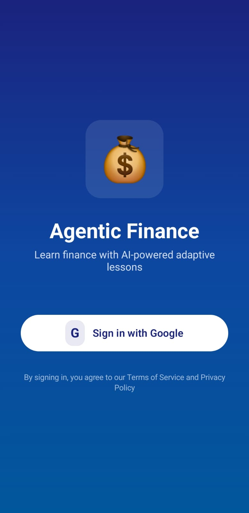
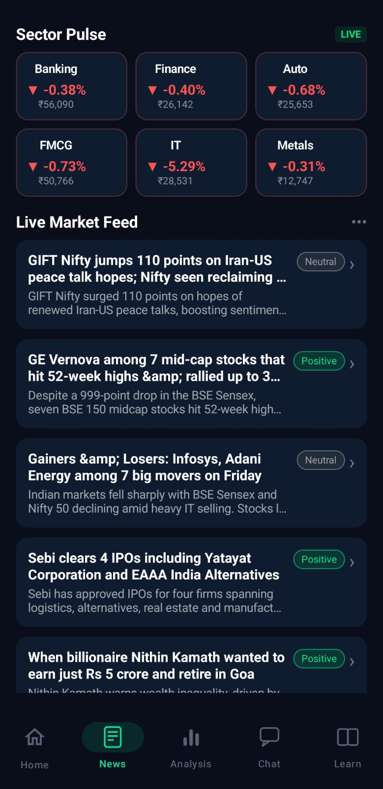
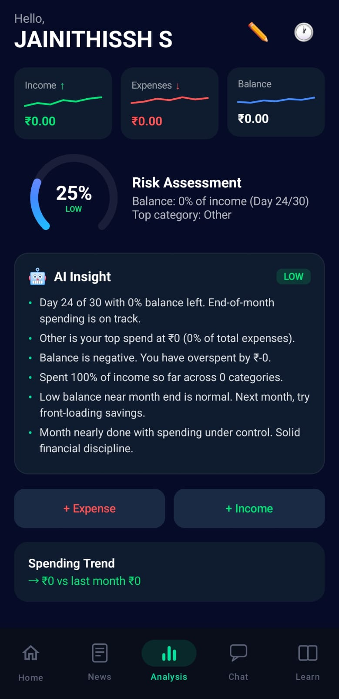
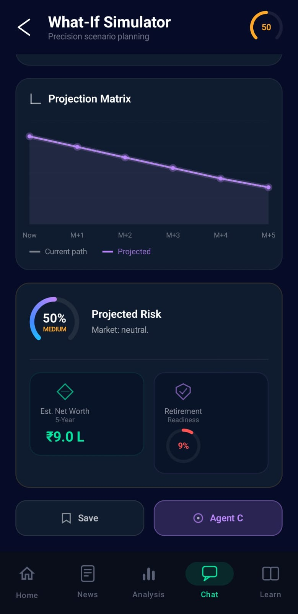
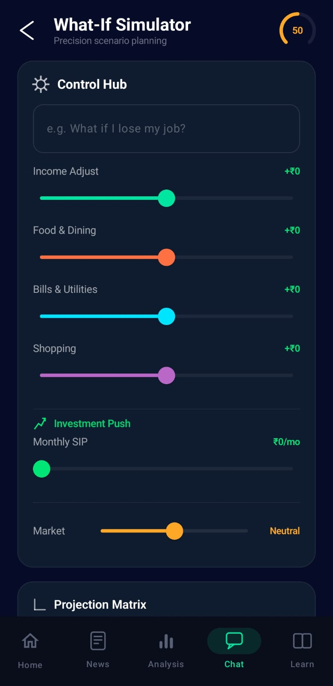
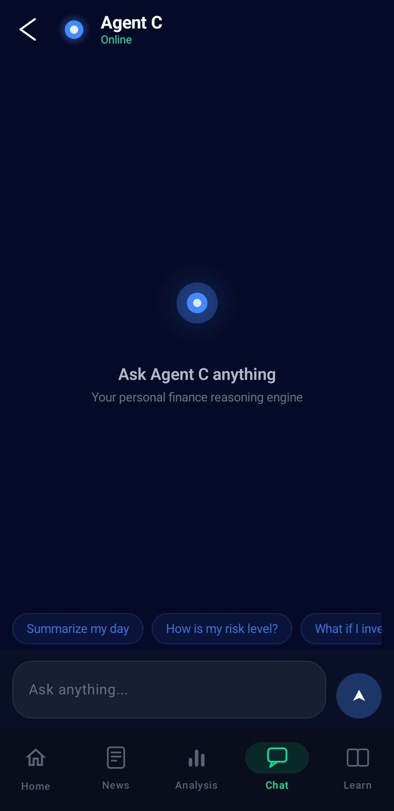
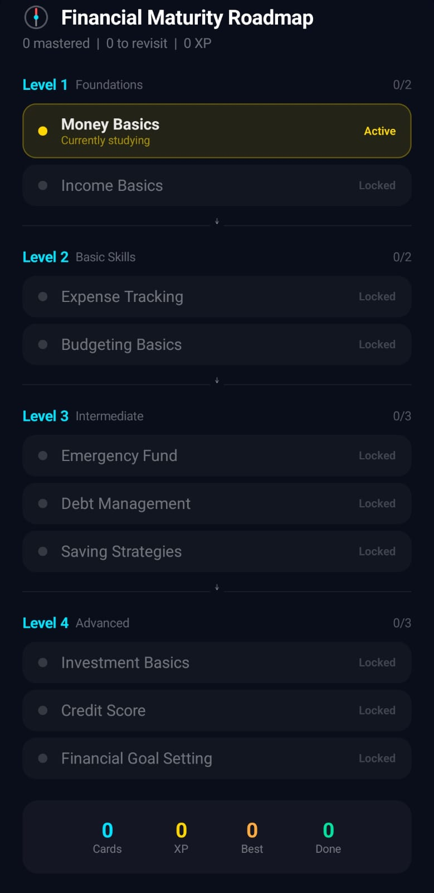
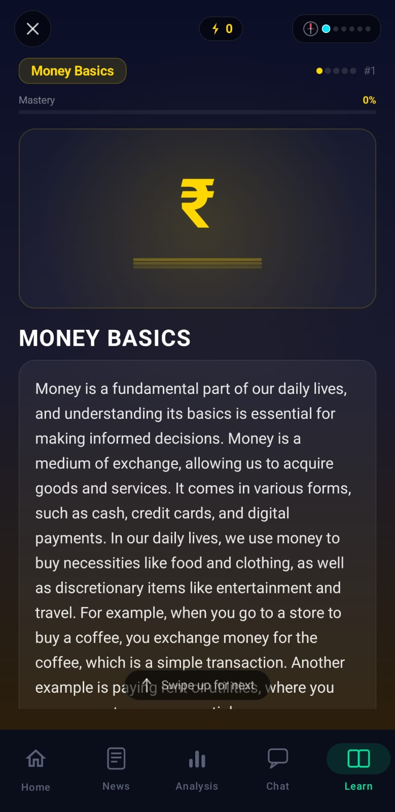

# Agentic Finance System

An AI-powered personal finance and market insight platform with a multi-agent backend, Android notification capture, retrieval-augmented answers, and adaptive financial learning.

## App Images

<p align="center">
	
</p>

The screenshots below are shown in the order they were captured from the `pinance` folder.

<table>
	<tr>
		<td align="center" width="33%">
			
			<br /><sub>1. Login screen</sub>
		</td>
		<td align="center" width="33%">
			
			<br /><sub>2. Home dashboard overview</sub>
		</td>
		<td align="center" width="33%">
			
			<br /><sub>3. Parsed transaction list</sub>
		</td>
	</tr>
	<tr>
		<td align="center" width="33%">
			
			<br /><sub>4. Spending breakdown and insights</sub>
		</td>
		<td align="center" width="33%">
			
			<br /><sub>5. Risk summary and financial status</sub>
		</td>
		<td align="center" width="33%">
			
			<br /><sub>6. Chat assistant and guidance view</sub>
		</td>
	</tr>
	<tr>
		<td align="center" width="33%">
			
			<br /><sub>7. Market overview screen</sub>
		</td>
		<td align="center" width="33%">
			
			<br /><sub>8. News sentiment details</sub>
		</td>
		<td align="center" width="33%">
			
			<br /><sub>9. Learning module overview</sub>
		</td>
	</tr>
	<tr>
		<td align="center" width="33%">
			
			<br /><sub>10. Quiz interaction screen</sub>
		</td>
		<td align="center" width="33%">
			
			<br /><sub>11. Roadmap progression view</sub>
		</td>
		<td align="center" width="33%">
			
			<br /><sub>12. Lesson detail and preview</sub>
		</td>
	</tr>
	<tr>
		<td align="center" width="33%">
			
			<br /><sub>13. Progress and achievements view</sub>
		</td>
		<td align="center" width="33%">
			
			<br /><sub>14. Category analytics and spending insights</sub>
		</td>
		<td align="center" width="33%">
			
			<br /><sub>15. Final overview or summary screen</sub>
		</td>
	</tr>
</table>

## What It Does

Agentic Finance System turns raw bank and UPI notifications, live market news, and curated finance knowledge into practical guidance.

- The Android app captures notification text and forwards it to the backend.
- The backend parses transactions, classifies spending, estimates financial risk, and analyzes market sentiment.
- A RAG-powered chatbot grounds answers in a curated finance knowledge base.
- An adaptive learning engine tracks concept mastery and serves personalized finance lessons.

## Why This Project Exists

Most finance tools solve only one part of the problem:

- Expense trackers store transactions but do not explain spending behavior.
- Market apps show news but do not connect it to personal finances.
- Robo-advisors focus on investments and overlook day-to-day spending patterns.
- Static learning apps do not adapt to a user's actual financial profile.

This project combines those pieces into one system that is explainable, personalized, and reliable even when external AI services are unavailable.

## System Overview

The report describes a three-agent architecture running on a FastAPI backend:

- Agent A: personal finance analysis from SMS and UPI notifications
- Agent B: news and market intelligence using FinBERT, NER, and trend prediction
- Agent C: grounded decision support with RAG and chat history

Each agent uses a two-tier pipeline:

- Tier 1: deterministic rule-based or ML inference
- Tier 2: LLM reasoning through Groq LLaMA 3.3 70B with fallback to Tier 1

The system also includes a Bayesian Knowledge Tracing learning engine for finance education.

## Key Features

- Automatic SMS and UPI notification parsing
- Amount, merchant, and debit/credit detection from raw text
- Transaction categorization with keyword rules and ML fallback
- Personal financial risk scoring over a date range
- Live financial news sentiment analysis
- Market trend prediction from aggregated sentiment signals
- Grounded finance recommendations with retrieved context and chat history
- Adaptive learning cards, roadmap progression, and mastery tracking

## Architecture Highlights

- Android client: Kotlin, Jetpack Compose, NotificationListenerService, Retrofit, Coroutines
- API backend: FastAPI, Python 3.11, Uvicorn
- Persistence: SQLite for development, Supabase PostgreSQL for production
- Authentication: Firebase Admin SDK
- NLP and ML: FinBERT, spaCy, scikit-learn, Transformers, PyTorch
- Retrieval and chat: TF-IDF RAG with Groq LLaMA 3.3 70B
- Deployment: Docker and Render support

## Repository Layout

- [backend/](backend/) - FastAPI app, routers, models, RAG, learning, and ML helpers
- [android/](android/) - Android client notes and integration details
- [docs/](docs/) - Architecture, roadmap, problem statement, and stack notes
- [presentation/](presentation/) - Presentation HTML for the project demo
- [scripts/](scripts/) - Helper scripts for APK and backend workflows

## Local Setup

From PowerShell on Windows:

```powershell
cd "c:\Users\jaini\OneDrive\Desktop\SEM-6\Software Engg\agentic-finance-system"
python -m pip install -r backend/requirements.txt
uvicorn backend.main:app --reload
```

The backend runs at http://127.0.0.1:8000.

## Main API Endpoints

- `GET /` - Service status
- `GET /api/health` - Backend health check
- `POST /api/parse_message` - Parse and store a transaction
- `GET /api/transactions` - List stored transactions
- `POST /api/analyze_finance` - Summarize spending and risk
- `POST /api/analyze_news` - Analyze market and news sentiment
- `GET /api/live_market` - Fetch the current market snapshot
- `POST /api/synthesize` - Generate grounded finance guidance
- `GET /api/learning/next-card` - Fetch the next learning card

## Tests

Run backend tests from the repo root:

```powershell
pytest backend/tests/test_api.py
```

## Model Utilities

To regenerate the synthetic dataset and retrain the category model:

```powershell
cd "c:\Users\jaini\OneDrive\Desktop\SEM-6\Software Engg\agentic-finance-system\backend"
python generate_synthetic_dataset.py
python train_category_model.py
```

If `backend/category_model.joblib` exists, the parser uses it automatically.

## Deployment

- Docker support is provided through the root `Dockerfile`
- `render.yaml` is included for Render deployment
- The backend also contains the Supabase schema and Firebase auth setup needed for production deployment

## Supporting Docs

- [backend/README.md](backend/README.md) - Backend-focused notes
- [android/README.md](android/README.md) - Android client notes
- [docs/roadmap.md](docs/roadmap.md) - Phase-by-phase roadmap
- [README_PRESENTATION.md](README_PRESENTATION.md) - Presentation notes
- [report_ieee_8p.tex](report_ieee_8p.tex) - Main IEEE-style project report source

## Scope

This repository centers on the backend, Android integration, and supporting documentation. Generated reports and presentation artifacts are kept in the workspace unless explicitly required elsewhere.
